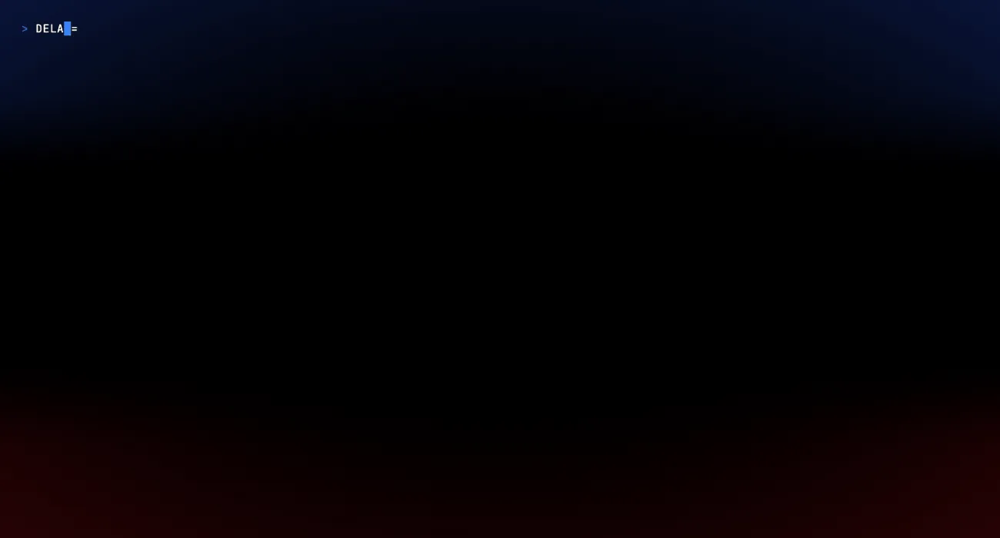

# atlas-ragnarok

[](LICENSE)
[](https://ghostty.org)
[](https://github.com/AyoubTadlaoui/atlas-ragnarok/actions/workflows/validate.yml)
[](https://github.com/AyoubTadlaoui/atlas-ragnarok/releases)
[](https://github.com/AyoubTadlaoui/atlas-ragnarok/stargazers)
[](https://github.com/AyoubTadlaoui/atlas-ragnarok/commits/main)


> Tech-blue thunder above. Crimson fire below. Pure black through the middle.
> The end-of-days terminal theme for [Ghostty](https://ghostty.org).

### The palette in motion



<sub>The storm-fire glow is the same atlas-ragnarok vignette you'd see in Ghostty — `screenshots/_shader.py` is a pixel-exact reimplementation of `atlas-ragnarok.glsl` (same colors, same smoothsteps, same luminance mask), applied to every frame in post since `vhs`/`ttyd` can't run the GPU shader directly. Text never gets tinted; backgrounds carry the glow. Also available as [MP4](screenshots/02-demo.mp4). Regenerate with `sh screenshots/gen.sh` (needs `vhs`, `ffmpeg`, `webp`, `bat`, `tree`, `pillow`, `numpy`).</sub>

A Ghostty theme + custom shader inspired by the Norse apocalypse — where the
sky cracks open with electric storm-blue and the world burns crimson beneath.
The middle stays pure black. Text never gets tinted: a luminance mask keeps
code, prompts, and output perfectly legible at every shader intensity.

Built on the syntactic structure of [Vesper](https://github.com/raunofreiberg/vesper)
(the orange-and-peppermint Rauno Freiberg VSCode theme), with the orange family
remapped to a Tailwind blue gradient and a storm/fire vignette layered on top
of pure-black `#000000`.

---

## Install

<details open>
<summary><b>macOS</b></summary>

```bash
git clone https://github.com/AyoubTadlaoui/atlas-ragnarok.git
cd atlas-ragnarok

mkdir -p ~/.config/ghostty/themes ~/.config/ghostty/shaders
cp atlas-ragnarok.conf ~/.config/ghostty/themes/
cp atlas-ragnarok.glsl ~/.config/ghostty/shaders/

# Activate it
echo 'config-file = ~/.config/ghostty/themes/atlas-ragnarok.conf' \
  >> "$HOME/Library/Application Support/com.mitchellh.ghostty/config.ghostty"
```

Reload with `Cmd+Shift+,` or restart Ghostty.

</details>

<details>
<summary><b>Linux</b></summary>

```bash
git clone https://github.com/AyoubTadlaoui/atlas-ragnarok.git
cd atlas-ragnarok

mkdir -p ~/.config/ghostty/themes ~/.config/ghostty/shaders
cp atlas-ragnarok.conf ~/.config/ghostty/themes/
cp atlas-ragnarok.glsl ~/.config/ghostty/shaders/

# Activate it
echo 'config-file = ~/.config/ghostty/themes/atlas-ragnarok.conf' \
  >> ~/.config/ghostty/config
```

Reload with `Ctrl+Shift+,` or restart Ghostty.

</details>

<details>
<summary><b>Windows (WSL2)</b></summary>

Ghostty doesn't yet ship a native Windows build. Run it under WSL2 with an
X-server (WSLg on Windows 11 handles this automatically).

```bash
# Inside your WSL2 shell
git clone https://github.com/AyoubTadlaoui/atlas-ragnarok.git
cd atlas-ragnarok

mkdir -p ~/.config/ghostty/themes ~/.config/ghostty/shaders
cp atlas-ragnarok.conf ~/.config/ghostty/themes/
cp atlas-ragnarok.glsl ~/.config/ghostty/shaders/

echo 'config-file = ~/.config/ghostty/themes/atlas-ragnarok.conf' \
  >> ~/.config/ghostty/config
```

Restart Ghostty in WSLg. If you're on Windows 10 (no WSLg), install
[VcXsrv](https://sourceforge.net/projects/vcxsrv/) and set `DISPLAY` in
your WSL profile.

> Want the palette in **Windows Terminal** or **WezTerm** instead?
> See [Terminals](#terminals) — the `palette = N=#hex` lines
> map cleanly to either format. The vignette shader is Ghostty-only.

</details>

<details>
<summary><b>PowerShell one-liner (downloads without git)</b></summary>

For Windows users who want the raw files without `git`:

```powershell
$dest = "$HOME\.config\ghostty"
New-Item -ItemType Directory -Force -Path "$dest\themes","$dest\shaders" | Out-Null
Invoke-WebRequest "https://raw.githubusercontent.com/AyoubTadlaoui/atlas-ragnarok/main/atlas-ragnarok.conf" -OutFile "$dest\themes\atlas-ragnarok.conf"
Invoke-WebRequest "https://raw.githubusercontent.com/AyoubTadlaoui/atlas-ragnarok/main/atlas-ragnarok.glsl" -OutFile "$dest\shaders\atlas-ragnarok.glsl"
Add-Content "$dest\config" "config-file = ~/.config/ghostty/themes/atlas-ragnarok.conf"
```

</details>

<details>
<summary><b>One-shot curl (macOS / Linux, no git)</b></summary>

```bash
mkdir -p ~/.config/ghostty/themes ~/.config/ghostty/shaders
curl -fsSL https://raw.githubusercontent.com/AyoubTadlaoui/atlas-ragnarok/main/atlas-ragnarok.conf \
  -o ~/.config/ghostty/themes/atlas-ragnarok.conf
curl -fsSL https://raw.githubusercontent.com/AyoubTadlaoui/atlas-ragnarok/main/atlas-ragnarok.glsl \
  -o ~/.config/ghostty/shaders/atlas-ragnarok.glsl

CONFIG="$HOME/.config/ghostty/config"
[[ "$OSTYPE" == "darwin"* ]] && CONFIG="$HOME/Library/Application Support/com.mitchellh.ghostty/config.ghostty"
echo 'config-file = ~/.config/ghostty/themes/atlas-ragnarok.conf' >> "$CONFIG"
```

</details>

---

## Palette

ANSI colors are Vesper's 5-color system, with the warm-accent family replaced
by a tech-blue gradient (Tailwind `blue-600` → `blue-300`).

| Role | Hex | Sample |
|------|-----|--------|
| Background | `#000000` | pure black |
| Foreground | `#ffffff` | white |
| Thunder-blue primary | `#3b82f6` | functions, types, cursor |
| Thunder-blue deep | `#2563eb` | tags, numbers |
| Thunder-blue bright | `#60a5fa` | emphasis |
| Thunder-blue pale | `#93c5fd` | accents |
| Peppermint | `#99ffe4` | strings, symbols, git-added |
| Gray | `#a0a0a0` | keywords, operators, storage |
| Crimson | `#ff8080` | errors, invalid, git-deleted |
| Selection | `#1e3a5f` | deep navy |

## Shader

The `atlas-ragnarok.glsl` shader adds the storm-fire vignette:

- **Top ~30%** of the screen — thunder-blue glow (`#0e1d52`-ish, vignetted)
- **Bottom ~30%** of the screen — crimson glow (`#380404`-ish, vignetted)
- **Middle ~40%** — untouched pure black
- **Text pixels** — never tinted (luminance mask kicks in at `lum > 0.04`)

The intensity curves are tuned for OLED + modern LCD. If you want to dial it
up or down, the knobs are at the bottom of `atlas-ragnarok.glsl`:

```glsl
vec3 thunder_blue = vec3(0.055, 0.115, 0.320);  // raise for more sky
vec3 red_tint     = vec3(0.220, 0.014, 0.028);  // raise for more fire

float top_only    = smoothstep(0.65, 0.85, 1.0 - uv.y);  // wider blue band
float bottom_only = smoothstep(0.65, 0.85, uv.y);        // wider red band
```

---

## Capturing your own screenshots

Two paths, depending on what you want:

### Static stills (best for showing the shader vignette)

The hero shot at the top — `screenshots/01-hero-vignette.png` — is captured
manually from a real Ghostty session so the GLSL shader vignette renders.
A small demo script ships in `scripts/demo.sh` to walk through four
screen-ready scenes (`bat` of the shader, colorful `git log --graph`,
a stubbed `cargo` build with errors + warnings + pass, and a `tree` of the
repo). Run and screenshot each scene:

```bash
# auto-advance every 4 seconds
bash scripts/demo.sh

# or press <enter> to advance manually
bash scripts/demo.sh manual
```

Drop captures into `screenshots/` and they're live in this README on push.

### Animated demo (cross-platform palette showcase)

`screenshots/02-demo.webp` (the looping clip above) is generated by
[vhs](https://github.com/charmbracelet/vhs) running the same demo script
under the atlas-ragnarok palette, then each captured frame is run through
`screenshots/_shader.py` — a NumPy+PIL reimplementation of the GLSL
shader. It applies the same geometry (`smoothstep(0.18, 1.0, dist)` radial
vignette, `smoothstep(0.65, 0.85, …)` top/bottom bands), the same colors
(`thunder_blue = vec3(0.055, 0.115, 0.320)`, `red_tint = vec3(0.220, 0.014,
0.028)`), and crucially the same **luminance mask**
(`bg_mask = 1 - smoothstep(0.04, 0.18, lum)`) so text pixels are never
tinted. ffmpeg reassembles the shaded frames into the WebP + MP4.

Regenerate any time with:

```bash
brew install vhs ffmpeg webp bat tree                          # one-time
pip3 install --user --break-system-packages pillow numpy       # one-time
sh screenshots/gen.sh                                          # 02-demo.{webp,mp4}
```

---

## Code editors

Atlas Ragnarok ships as a full color theme to every major editor — see
[**EDITORS.md**](EDITORS.md) for the install + publish matrix.

| Editor | Install | Source |
|---|---|---|
| **VS Code / Cursor / VSCodium** | `code --install-extension AyoubTadlaoui.atlas-ragnarok` | [`editors/vscode/`](editors/vscode/) |
| **Zed** | `zed: install extension atlas-ragnarok` | [`editors/zed/`](editors/zed/) |
| **JetBrains** (IntelliJ, PyCharm, GoLand, WebStorm, Rider, RustRover, CLion, RubyMine, PhpStorm, DataGrip, Android Studio) | Plugins → Marketplace → Atlas Ragnarok | [`editors/jetbrains/`](editors/jetbrains/) |
| **Neovim** | `{ "AyoubTadlaoui/atlas-ragnarok", rtp = "editors/neovim" }` | [`editors/neovim/`](editors/neovim/) |
| **Vim** | `Plug 'AyoubTadlaoui/atlas-ragnarok', { 'rtp': 'editors/vim' }` | [`editors/vim/`](editors/vim/) |
| **Helix** | `cp editors/helix/atlas-ragnarok.toml ~/.config/helix/themes/` | [`editors/helix/`](editors/helix/) |
| **Sublime Text 4** | Drop the `.sublime-color-scheme` into `Packages/User/` | [`editors/sublime/`](editors/sublime/) |

Full syntax + UI coverage in every port: comments, strings, numbers, keywords,
functions, types, tags, variables, properties, decorators, markdown, diff,
git decorations, debugger, terminal pane, and Treesitter / LSP semantic tokens
where supported.

## Terminals

- **Ghostty** ≥ 1.0 — full support (theme + shader)
- **Alacritty** — palette ported in [`themes/alacritty.toml`](themes/alacritty.toml).
  Import via `general.import = ["~/.config/alacritty/themes/atlas-ragnarok.toml"]`.
- **Kitty** — palette ported in [`themes/kitty.conf`](themes/kitty.conf).
  Drop into `~/.config/kitty/` and `include atlas-ragnarok.conf` from your `kitty.conf`.
- **WezTerm** — palette ported in [`themes/wezterm.lua`](themes/wezterm.lua).
  Drop into `~/.config/wezterm/colors/`, then reference via `color_scheme = 'atlas-ragnarok'`.
- **iTerm2** — palette ported in [`themes/iterm2.itermcolors`](themes/iterm2.itermcolors).
  Double-click the file in Finder to import as a Color Preset.
- **Windows Terminal** — palette ported in [`themes/windows-terminal.json`](themes/windows-terminal.json).
  Add the object to the `schemes` array in `settings.json`, then set `"colorScheme": "atlas-ragnarok"` on a profile.
- **Other terminals** — PRs welcome — see [CONTRIBUTING.md](CONTRIBUTING.md).

---

## Credits

- Palette structure inherited from [raunofreiberg/vesper](https://github.com/raunofreiberg/vesper) (MIT)
- Tailwind color tokens for the blue gradient
- Forged by [Atlas Kaisar](https://github.com/AyoubTadlaoui)

## License

[MIT](./LICENSE) — do whatever you want, just keep the copyright notice.
